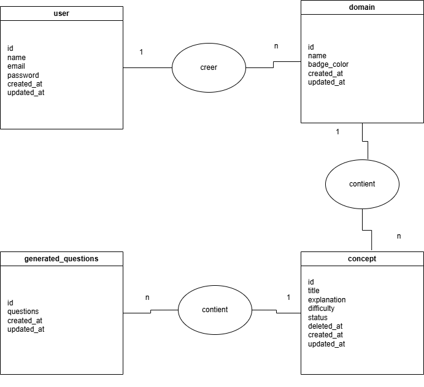
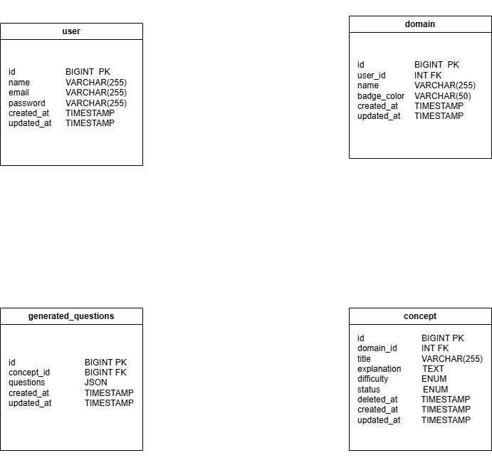
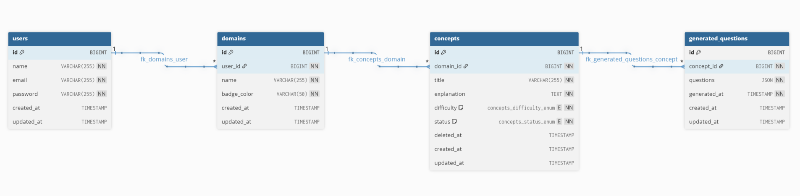
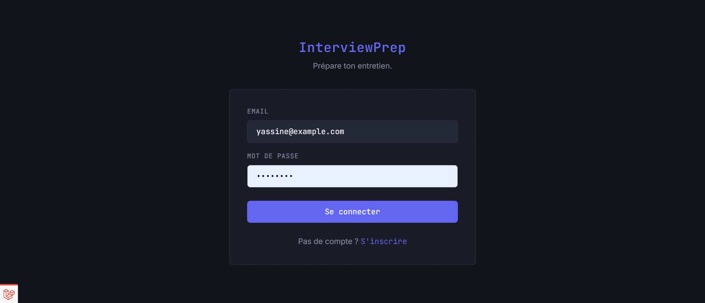
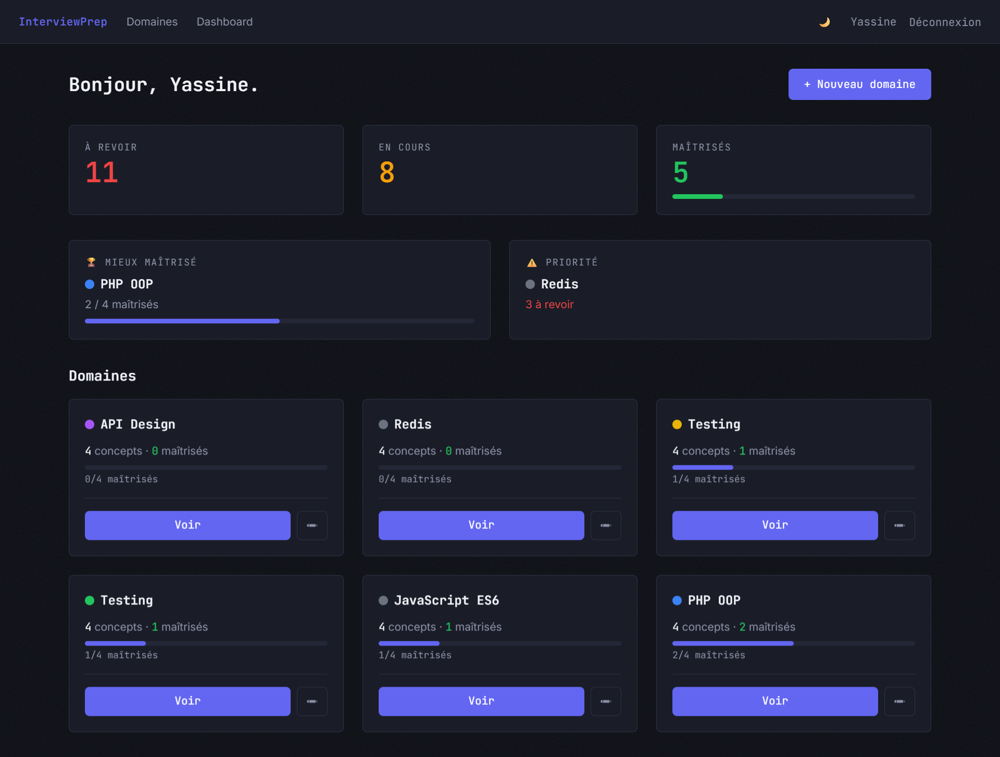
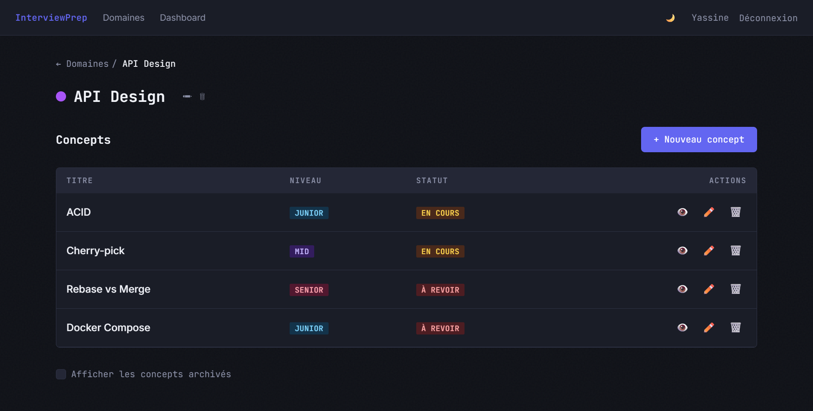
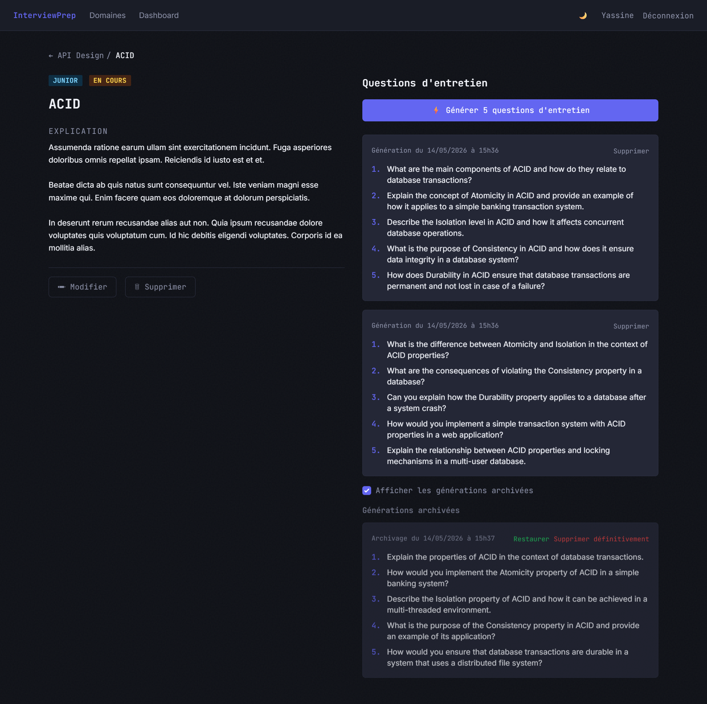
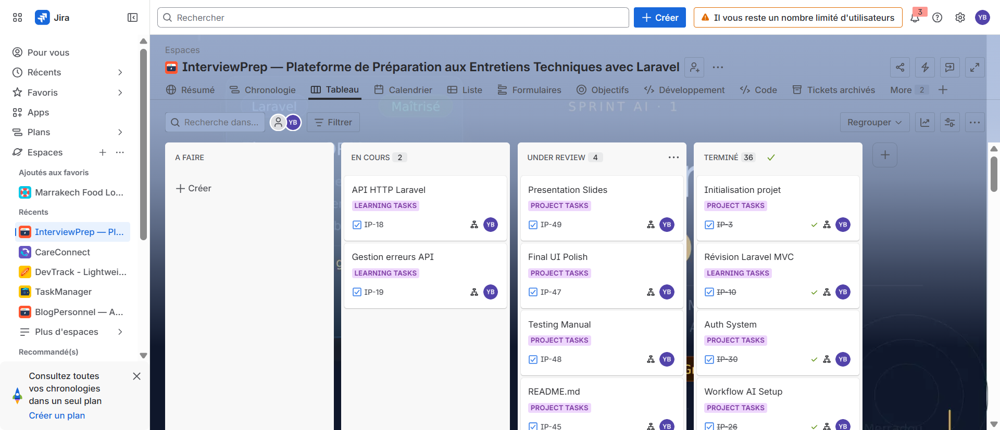

# InterviewPrep — AI-Powered Interview Question Generator

## Overview

InterviewPrep is a personal interview preparation platform built with **Laravel** framework.

It helps developers organize technical topics into **Domains** and **Concepts**, generate realistic interview questions via the **Groq AI API**, and track their mastery progress over time.

The application follows Laravel best practices using:

- MVC Architecture
- Eloquent ORM
- Blade templating
- Named routes
- Middleware authentication
- Policy-based authorization
- Form Requests validation
- Soft Deletes
- Accessors & Scopes
- Eager loading (N+1 prevention)

---

# 🚀 Features

# 🔐 Authentication

Users can:

- Register securely
- Login securely
- Logout securely

Authentication is powered by Laravel Breeze.

---

# 📁 Domain Management

Users can:

- Create domains (e.g. "Laravel ORM", "PHP OOP")
- Edit domains
- Archive (soft-delete) domains
- Restore archived domains
- Permanently delete archived domains

Each domain includes:

- Name
- Color badge
- Concept count
- Mastery progress bar

---

# 📋 Concept Management

Users can:

- Create concepts under a domain
- Edit concepts
- Archive (soft-delete) concepts
- Restore archived concepts
- Permanently delete archived concepts
- Filter concepts by status and difficulty simultaneously

Each concept includes:

- Title
- Explanation (detailed technical note)
- Difficulty level (Junior / Mid / Senior)
- Mastery status (À revoir / En cours / Maîtrisé)
- Quick status toggle from the list view
- Generated interview questions history

---

# 🤖 AI Question Generation

Users can generate 5 realistic technical interview questions per concept via the **Groq API**:

- Click "Generate Interview Questions" on a concept detail page
- The API receives: title, explanation, difficulty, status
- Returns 5 distinct questions saved as JSON in the database
- Full generation history with timestamps
- Soft-delete support for old generations
- Error handling: if the API fails, a clean error message is shown — never a blank page

The service is isolated in `app/Services/GroqService.php` and configured via `.env`:

```
GROQ_API_KEY=
GROQ_MODEL=llama3-8b-8192
GROQ_API_URL=https://api.groq.com/openai/v1/chat/completions
```

---

# 📊 Analytics Dashboard

The dashboard provides:

- Concepts by status count
- Best mastered domain (highest mastery ratio)
- Domain most in need of review (most "to review" concepts)
- Total domain and concept counts
- Quick link to create new domain
- List of all domains with progress bars

---

# 🎁 Bonus Features

- Soft Deletes with cascade on Domain → Concept → GeneratedQuestion
- Restore and force-delete for all three models
- Accessors:
    - `status_label` (À revoir / En cours / Maîtrisé)
    - `difficulty_label` (Junior / Mid / Senior)
- Light/Dark mode toggle with localStorage persistence
- Combined filters (status + difficulty) on concept list
- Archived items toggle with checkbox UI
- N+1 prevention using `withCount()` and eager loading
- Laravel Debugbar for query monitoring

---

# 🛠 Technologies Used

- Laravel 13
- PHP 8.3+
- MySQL
- Blade
- Eloquent ORM
- Laravel Breeze (authentication scaffold)
- Tailwind CSS (dark utilitarian theme)
- Vite
- Laravel Policies (DomainPolicy, ConceptPolicy, GeneratedQuestionPolicy)
- Laravel Form Requests
- Groq AI API (llama3-8b-8192)
- JetBrains Mono + Inter fonts

---

# 🛠 Installation

## Prerequisites

- PHP 8.3+
- Composer
- Node.js + NPM
- MySQL
- Laravel CLI (optional)
- XAMPP / Laragon / WAMP

## Installation Steps

1. Clone repository

```bash
git clone https://github.com/BEN-ESSAHRAOUI-Yassine/lnterviewPrep.git
cd lnterviewPrep
```

2. Install dependencies

```bash
composer install
npm install
```

3. Environment configuration

```bash
cp .env.example .env
php artisan key:generate
```

4. Configure database

Edit `.env`:

```bash
DB_CONNECTION=mysql
DB_HOST=127.0.0.1
DB_PORT=3306
DB_DATABASE=interviewprep
DB_USERNAME=root
DB_PASSWORD=
```

5. Configure Groq API

Edit `.env`:

```bash
GROQ_API_KEY=your_groq_api_key_here
GROQ_MODEL=llama3-8b-8192
GROQ_API_URL=https://api.groq.com/openai/v1/chat/completions
```

6. Run migrations and seeders

```bash
php artisan migrate:fresh --seed
```

7. Compile frontend assets

```bash
npm run build
```

8. Start server

```bash
php artisan serve
```

Visit:

```
http://127.0.0.1:8000
```

Default login:

| Email | Password |
|-------|----------|
| yassine@example.com | password |

---

# 📁 Directory Structure

```text
app/
├── Http/
│   ├── Controllers/
│   │   ├── DomainController.php
│   │   ├── ConceptController.php
│   │   ├── GeneratedQuestionController.php
│   │   ├── DashboardController.php
│   │   └── Auth/
│   │       ├── RegisteredUserController.php
│   │       └── AuthenticatedSessionController.php
│   │
│   ├── Requests/
│   │   ├── StoreDomainRequest.php
│   │   ├── UpdateDomainRequest.php
│   │   ├── StoreConceptRequest.php
│   │   └── UpdateConceptRequest.php
│   │
│   └── Controllers/Auth/
│       └── RegisterRequest.php
│       └── LoginRequest.php
│
├── Models/
│   ├── User.php
│   ├── Domain.php
│   ├── Concept.php
│   └── GeneratedQuestion.php
│
├── Policies/
│   ├── DomainPolicy.php
│   ├── ConceptPolicy.php
│   └── GeneratedQuestionPolicy.php
│
└── Services/
    └── GroqService.php

database/
├── migrations/
├── factories/
│   ├── UserFactory.php
│   ├── DomainFactory.php
│   └── ConceptFactory.php
└── seeders/
    └── DatabaseSeeder.php

resources/views/
├── layouts/
│   ├── app.blade.php
│   └── guest.blade.php
├── auth/
│   ├── login.blade.php
│   └── register.blade.php
├── domains/
│   ├── index.blade.php
│   ├── create.blade.php
│   ├── edit.blade.php
│   ├── show.blade.php
│   └── archived.blade.php
├── concepts/
│   ├── index.blade.php
│   ├── create.blade.php
│   ├── edit.blade.php
│   └── show.blade.php
└── dashboard.blade.php

routes/
└── web.php
```

---

# 🛣 Routing System

| Method | Route | Controller |
|--------|-------|------------|
| GET | / | DashboardController@index |
| GET | /login | Auth\AuthenticatedSessionController@create |
| POST | /login | Auth\AuthenticatedSessionController@store |
| POST | /logout | Auth\AuthenticatedSessionController@destroy |
| GET | /register | Auth\RegisteredUserController@create |
| POST | /register | Auth\RegisteredUserController@store |
| GET | /dashboard | DashboardController@index |
| GET | /domains | DomainController@index |
| GET | /domains/archived | DomainController@archived |
| GET | /domains/create | DomainController@create |
| POST | /domains | DomainController@store |
| GET | /domains/{domain} | DomainController@show |
| GET | /domains/{domain}/edit | DomainController@edit |
| PATCH | /domains/{domain} | DomainController@update |
| DELETE | /domains/{domain} | DomainController@destroy |
| PATCH | /domains/{domain}/restore | DomainController@restore |
| DELETE | /domains/{domain}/force-delete | DomainController@forceDelete |
| GET | /domains/{domain}/concepts | ConceptController@index |
| GET | /domains/{domain}/concepts/create | ConceptController@create |
| POST | /domains/{domain}/concepts | ConceptController@store |
| GET | /domains/{domain}/concepts/{concept} | ConceptController@show |
| GET | /domains/{domain}/concepts/{concept}/edit | ConceptController@edit |
| PATCH | /domains/{domain}/concepts/{concept} | ConceptController@update |
| PATCH | /domains/{domain}/concepts/{concept}/status | ConceptController@updateStatus |
| DELETE | /domains/{domain}/concepts/{concept} | ConceptController@destroy |
| PATCH | /domains/{domain}/concepts/{concept}/restore | ConceptController@restore |
| DELETE | /domains/{domain}/concepts/{concept}/force-delete | ConceptController@forceDelete |
| POST | /concepts/{concept}/generate | GeneratedQuestionController@store |
| DELETE | /generated-questions/{generatedQuestion} | GeneratedQuestionController@destroy |
| PATCH | /generated-questions/{id}/restore | GeneratedQuestionController@restore |
| DELETE | /generated-questions/{id}/force-delete | GeneratedQuestionController@forceDelete |

---

# 🗄 Database Design

## Tables

- users
- domains
- concepts
- generated_questions

## Relationships

**User → Domains**: One user has many domains.
**Domain → Concepts**: One domain has many concepts.
**Concept → GeneratedQuestions**: One concept has many generated question batches.

## Cascade Soft Deletes

- Soft-deleting a Domain → soft-deletes all its Concepts → soft-deletes all their GeneratedQuestions
- Soft-deleting a Concept → soft-deletes all its GeneratedQuestions
- Restoring is always individual (no auto-restore of children)

## MCD



## MLD



## DB Diagram



---

# 🔒 Security Measures

- Authentication middleware on all routes except login/register
- Password hashing with bcrypt
- CSRF protection on all forms
- Form Request validation (never inline `$request->validate()` in controllers)
- Policy-based authorization (never manual `abort(403)` in controllers)
- Route model binding
- Parent verification on nested routes (`abort_if($concept->domain_id !== $domain->id, 404)`)
- Query scoping to `auth()->id()` on all index/list queries
- Eager loading before policy authorization calls

---

# 📌 Laravel Concepts Used

- **Policies**

    - DomainPolicy — user must own the domain
    - ConceptPolicy — user must own the parent domain
    - GeneratedQuestionPolicy — user must own the root domain

- **Form Requests**

    - StoreDomainRequest, UpdateDomainRequest
    - StoreConceptRequest, UpdateConceptRequest

- **Soft Deletes**

    All three models (Domain, Concept, GeneratedQuestion) use Laravel's `SoftDeletes` trait with manual cascade in `delete()` overrides.

- **Accessors**

    - `status_label` → "À revoir", "En cours", "Maîtrisé"
    - `difficulty_label` → "Junior", "Mid", "Senior"

- **N+1 Prevention**

    - `withCount()` on domain index for concept counts
    - `with('generatedQuestions')` on concept queries
    - Eager loading before policy calls

# 🐞 Debugging Tools

- **Laravel Debugbar**

    Used to detect N+1 queries, monitor SQL, and analyze performance.

- **Laravel Telescope**

    Access at `/telescope` to inspect requests, exceptions, and queries.

---

# 📋 [Jira Board](https://ybenessahraoui.atlassian.net/jira/software/projects/IP/boards/200?atlOrigin=eyJpIjoiMjhlMzBkYzdiN2I5NDdmZWIzODJiZjFjMzI4YzUzNjAiLCJwIjoiaiJ9)

# 📋 [Presentation Link](https://docs.google.com/presentation/d/1mVgJFh4FDTGtMkCzKO5jySFusugCOdgoJUZN9pc8eXo/edit?usp=sharing)


# 📸 Screenshots

## Login Page



## Dashboard



## Project Details



## Tasks Dashboard



## Jira board

